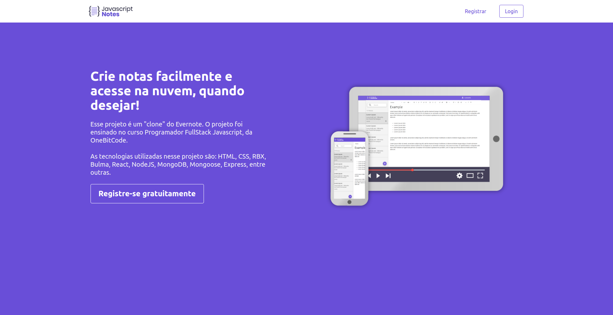
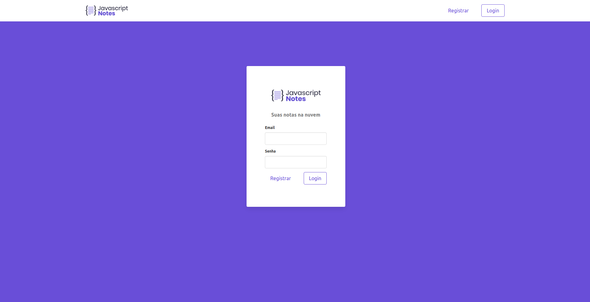
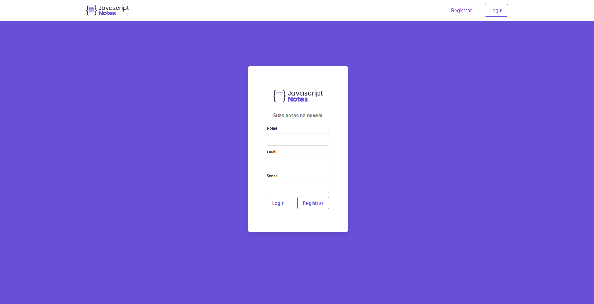
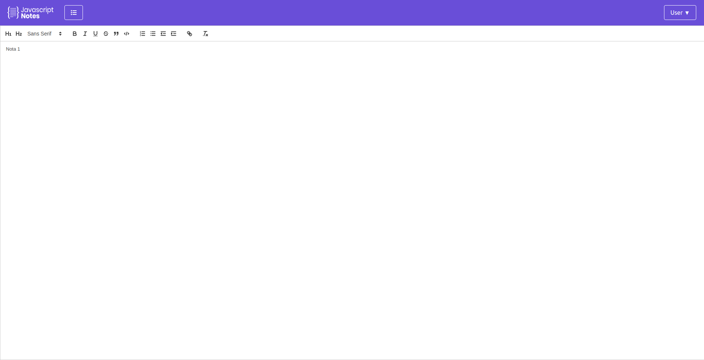
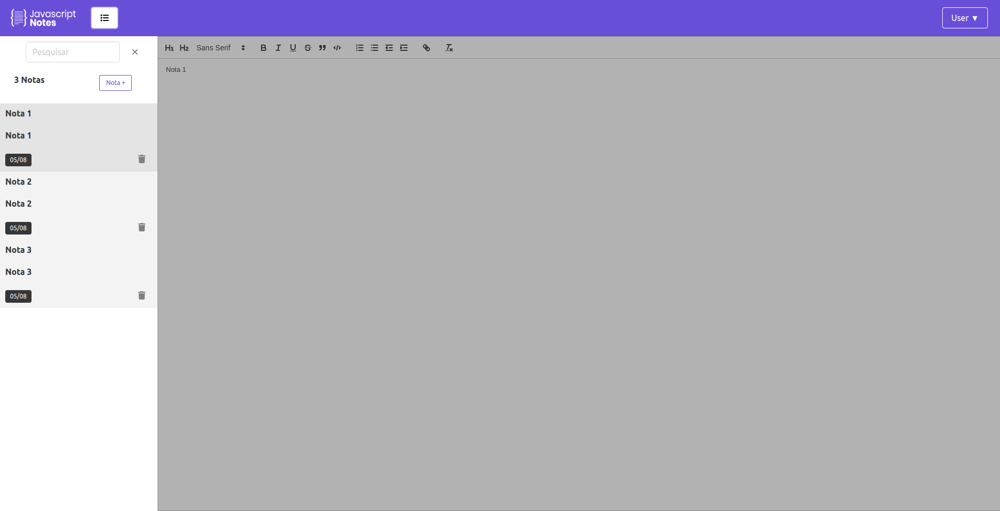
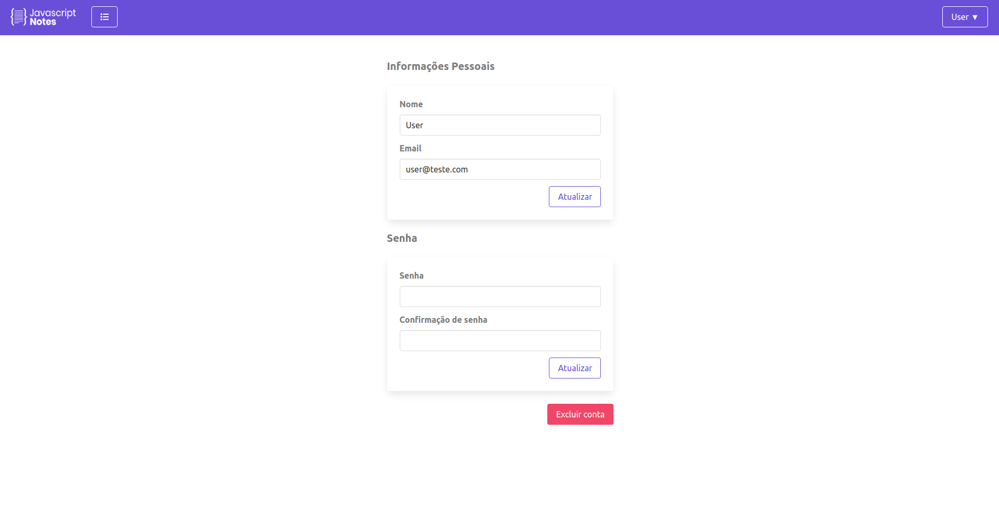

<h1 align="center">Clone Evernote JS</h1>
<p align="center">Esse site é um "clone" do aplicativo Evernote, porém em versão web, realizado no curso Programador Full Stack JavaScript Profissional, da OneBitCode.</p>
</br>
<p align="center">
<a href="https://github.com/marcelosarinho/cloneEvernoteJS/issues"></a>
<a href="https://github.com/marcelosarinho/cloneEvernoteJS/network"></a>
<a href="https://github.com/marcelosarinho/cloneEvernoteJS/stargazers"></a>
</p>
<p align="center">
<a href="#sobre">Sobre</a> • 
<a href="#pre-requisitos">Pré-Requisitos</a> • 
<a href="#tecnologias">Tecnologias</a> • 
<a href="#licenca">Licença</a> •
<a href="#autor">Autor</a>
</p>
<h4 align="center"> ✔️ Projeto finalizado! ✔️ </h4>
<h1></h1>
<h2>🌐 Demonstração</h2>
<div>
  <h3 align="center">
   
  </h3>
  <br/>
  <h3 align="center">
   
  </h3>
  <br/>
  <h3 align="center">
   
  </h3>
  <br/>
  <h3 align="center">
   
  </h3>
  <br/>
  <h3 align="center">
   
  </h3>
  <br/>
  <h3 align="center">
   
  </h3>
  <br/>
</div>
<h2 id="sobre">📖 Sobre</h2>
<p>Esse repositório é um site "clone" do aplicativo Evernote, e foi realizado no curso Programador Full Stack JavaScript Profissional, da OneBitCode. O projeto serviu para entender como desenvolver um aplicativo de maior complexidade, misturando o Front End e Back End, além do deploy.</p>
<h2 id="pre-requisitos">📋 Pré-Requisitos</h2>
<p>Para testar essa aplicação, é necessário <a href="https://git-scm.com/">Git</a> e <a href="https://www.npmjs.com/">npm</a> (ou <a href="https://yarnpkg.com/">Yarn</a>).</p>
<p>Caso queira testar o projeto na sua máquina, siga esses passos:</p>

```bash
# Ligando a API

# Clone o repositório
$ git clone <https://github.com/marcelosarinho/cloneEvernoteJS>

# Acesse a pasta do projeto clonado
$ cd cloneEvernoteJS

# Acesse a pasta da API
$ cd clone_evernote_js_api

# Instale as dependências do projeto
$ npm install

# Execute o comando
$ PORT=4000 nodemon start

# A API foi conectada!

# Ligando o cliente React

# Abra outro terminal na pasta cloneEvernoteJS
# Acesse a pasta do cliente React

$ cd clone_evernote_js

# Instale as dependências do projeto
$ npm install

# Execute o comando
$ npm start

# O site aparecerá automaticamente, caso não apareça acesse <http://localhost:3000/>

# Pronto, o projeto está ligado!

```

<h2 id="tecnologias">💻 Tecnologias utilizadas</h2>


<br/>

<br/>
<a href="https://bulma.io/"></a>
<br/>
<a href="https://www.javascript.com/"></a>
<br/>
<a href="https://reactjs.org/"></a>
<br/>
<a href="https://reactrouter.com/"></a>
<br/>
<a href="https://nodejs.org/en/"></a>
<br/>
<a href="https://expressjs.com/"></a>
<br/>
<a href="https://www.mongodb.com/cloud/atlas/lp/try2?utm_content=controlhterms&utm_source=google&utm_campaign=gs_americas_brazil_search_core_brand_atlas_desktop&utm_term=mongodb&utm_medium=cpc_paid_search&utm_ad=e&utm_ad_campaign_id=12212624308&adgroup=115749706023&gclid=EAIaIQobChMI6_DEz6Kw-QIVTciUCR0uuADzEAAYASAAEgJ2O_D_BwE"></a>
<h2 id="licenca">📜 Licença</h2>
Esse projeto utiliza a Licença MIT.
<h2 id="autor">👨‍💻 Autor</h2>
<br/>
<div align="center">
<a href="https://github.com/marcelosarinho">

</a>
<h3>Marcelo Sarinho</h3>
<h4>Contato</h4>
<a href="https://github.com/marcelosarinho"></a>
<a href="https://www.linkedin.com/in/marcelo-sarinho-a4706923a/"></a>
<a href="mailto:marceloactsarinho@gmail.com"></a>
</div>
